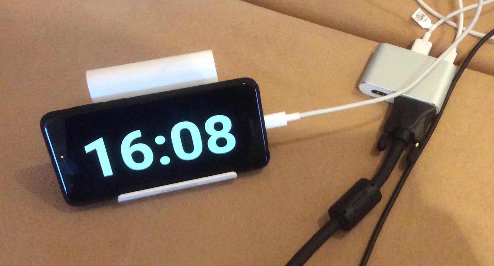
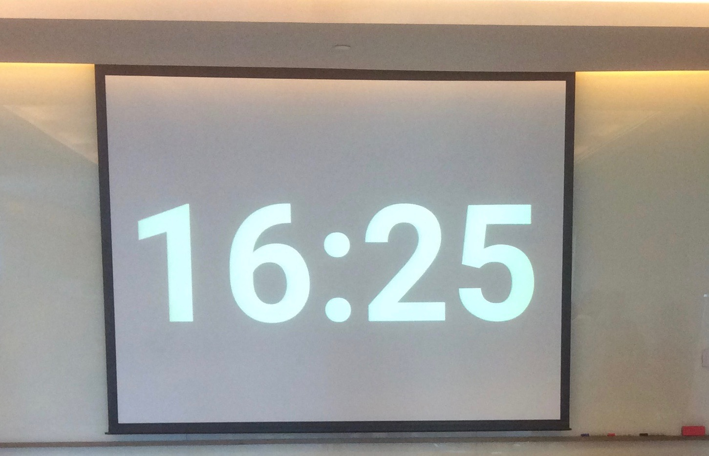

# Pomodoro/专心倒计时 App For Android

**download [APK/下载应用][0]** 

____

Why should we need another pomodoro (focused timer)? The current existing Apps are too distracting. They either have too fancy outlook, keep asking for upgrade to pro version, or showing ads. That is really annoying. 
Help yourself! As a Ex-SW Engineer, this is my first Android App. While focusing on book, work or other task you should have it. For trainers, it is also a convenient coundown timer for classroom.
What we need is a KISS one: Keep it Simple and Stupid. no much options. black and white. 

____

____
## Usage:

1. Start/Pause timer: **double click/tap** on the screen; **long press** pause the timer.
2. Stop/Cancel timer: **Fling through the whole screen horizontally**. (exact from left edge to right edge)
3. Switch to predefined timers(45,30, 25, 15, 10, 7, 5, 3, 1min), on the ready state (no timer is running or paused), **Fling cross the main width of screen**. 
4. Adjust the timer setting: **Pinch (Zoom)** with 2 fingers, or **scroll** (one finger flip vertically).

____

市场上的番茄钟应用都太炫、充斥了广告和推广信息，甚至申请各种不必要的权限，完全是与专心致志的目标背道而驰。求人不如求己，自己开发一个吧！"前软件工程师"开发的第一个安卓手机应用，极简单、极干净、不要额外的权限，不要广告。满足自己看书、工作甚至培训上课的需要。

## 使用方法：

1. 启动/暂停：**双击** 屏幕, **长按** 暂停。
2. 停止/取消：**水平从左边缘划到右边缘**
3. 切换预设时间（45,30, 25, 15, 10, 7, 5, 3, 1分钟）：在定时器不处于运行或暂停的状态时，**水平滑过屏幕**
4. 自由调整时间：**缩放（2指），滚动（1指，垂直方向）**

____
## use it in the training room / 在培训教室里使用：

[0]:https://github.com/stevechenzy/Pomodoro/raw/master/apk/app-release.apk
